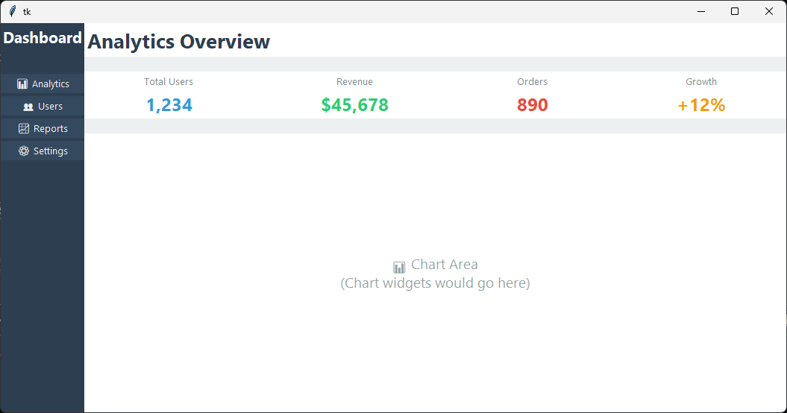

# Modern TK

[](https://badge.fury.io/py/modern-tk)
[](https://opensource.org/licenses/MIT)
[](https://pypi.org/project/modern-tk/)

Modern TK is a Python library that brings modern, CSS-inspired styling to traditional Tkinter applications. It provides a declarative approach to UI design with support for themes, effects, and responsive layouts.

---
> Status: This project development is currently inactive. Interfaces, schemas, and docs may change frequently until the initial stable release. Hoping for someone to contribute to make this project a better library for UI development.


*Modern dashboard built with Modern TK*

## Features

- 🎨 **CSS-inspired Styling**: Declarative styling system similar to CSS
- 🌈 **Advanced Theming**: Built-in themes (Default, Dark, Material, Fluent)
- ✨ **Visual Effects**: Shadows, gradients, rounded corners, and more
- 🧱 **Enhanced Widgets**: Modern versions of all standard Tkinter widgets
- 📐 **Flexible Layouts**: Flexbox and grid-based layout systems
- 🎯 **State Management**: Hover, active, focused, and disabled states
- 📱 **Responsive Design**: Adaptive layouts for different screen sizes
- 🔌 **Plugin System**: Extensible architecture for custom components

## Installation

Install Modern TK using pip:

```bash
pip install modern-tk
```

### Requirements

- Python 3.7+
- Pillow >= 8.0.0

## Quick Start

Here's a simple example to get you started:

```python
from modern_tk import App, Button, Entry, Frame, Label

def main():
    # Create app with default theme
    app = App(theme="default", title="Modern TK Demo", geometry="400x300")
    
    # Create main container
    main_frame = Frame(
        app,
        style={
            'bg': '#f8f9fa',
            'padding': 20
        }
    )
    main_frame.pack(fill='both', expand=True)
    
    # Title label
    title = Label(
        main_frame,
        text="Welcome to Modern TK!",
        style={
            'font': ('Segoe UI', 16, 'bold'),
            'fg': '#2c3e50',
            'bg': '#f8f9fa'
        }
    )
    title.pack(pady=(0, 20))
    
    # Entry field
    entry = Entry(
        main_frame,
        placeholder="Enter your name...",
        style={
            'font': ('Segoe UI', 10),
            'padding': (10, 8),
            'radius': 6,
            'border_width': 2,
            'border_color': '#e9ecef',
            'focused_border_color': '#0078d4'
        }
    )
    entry.pack(fill='x', pady=(0, 15))
    
    # Button with hover effects
    def on_click():
        name = entry.get()
        if name:
            result_label.set_text(f"Hello, {name}!")
        else:
            result_label.set_text("Please enter your name!")
    
    button = Button(
        main_frame,
        text="Say Hello",
        command=on_click,
        style={
            'bg': '#0078d4',
            'fg': 'white',
            'font': ('Segoe UI', 10, 'bold'),
            'padding': (15, 8),
            'radius': 6,
            'hover_bg': '#106ebe',
            'active_bg': '#005a9e',
            'border_width': 0
        }
    )
    button.pack(pady=(0, 15))
    
    # Result label
    result_label = Label(
        main_frame,
        text="Enter your name and click the button!",
        style={
            'font': ('Segoe UI', 10),
            'fg': '#6c757d',
            'bg': '#f8f9fa'
        }
    )
    result_label.pack()
    
    app.run()

if __name__ == "__main__":
    main()
```


*Simple application with styled widgets*

## Core Concepts

### 1. Styling System

Modern TK uses a declarative styling system inspired by CSS. Styles are defined as dictionaries and applied to widgets:

```python
button = Button(
    text="Click Me",
    style={
        'bg': '#0078d4',
        'fg': 'white',
        'font': ('Segoe UI', 10, 'bold'),
        'padding': (15, 8),
        'radius': 6,
        'hover_bg': '#106ebe',
        'active_bg': '#005a9e',
        'shadow': True
    }
)
```

### 2. State-Based Styling

Widgets support multiple states with specific styling:

```python
button = Button(
    text="State Button",
    style={
        'bg': '#f0f0f0',
        'fg': '#333333',
        'hover_bg': '#e0e0e0',
        'active_bg': '#d0d0d0',
        'disabled_bg': '#cccccc'
    }
)
```

### 3. Style Classes

Reusable style classes can be defined and applied:

```python
from modern_tk import StyleClass

@StyleClass
class PrimaryButton:
    bg = '#0078d4'
    fg = 'white'
    font = ('Segoe UI', 10, 'bold')
    padding = (15, 8)
    radius = 6
    hover_bg = '#106ebe'
    active_bg = '#005a9e'

button = Button(
    text="Primary Button",
    style_class=PrimaryButton
)
```

## Theming System

Modern TK includes several built-in themes and supports custom themes:

### Built-in Themes

- **Default**: Clean, light theme
- **Dark**: Dark mode theme
- **Material**: Material Design inspired
- **Fluent**: Microsoft Fluent Design inspired

### Using Themes

```python
from modern_tk import App, Theme

# Create app with specific theme
app = App(theme="dark")

# Or switch themes dynamically
Theme.use("material")
```

### Custom Themes

Create custom themes by defining a theme dictionary:

```python
custom_theme = {
    "colors": {
        "primary": "#3498db",
        "secondary": "#2ecc71",
        "background": "#ecf0f1"
    },
    "fonts": {
        "default": ("Arial", 10, "normal")
    },
    "widgets": {
        "button": {
            "bg": "@colors.primary",
            "fg": "white",
            "padding": (12, 6)
        }
    }
}

Theme.register("custom", custom_theme)
Theme.use("custom")
```

## Widgets

Modern TK provides enhanced versions of all standard Tkinter widgets with additional styling capabilities:

| Widget | Description |
|--------|-------------|
| `Button` | Clickable button with hover effects |
| `Frame` | Container for grouping widgets |
| `Label` | Text or image display |
| `Entry` | Single-line text input |
| `Text` | Multi-line text input |
| `Checkbox` | Boolean selection control |
| `RadioButton` | Single selection from group |
| `ProgressBar` | Progress indicator |
| `Canvas` | Drawing surface |
| `ListBox` | List of selectable items |
| `Scrollbar` | Scroll control |

## Layout System

Modern TK provides flexible layout systems:

### Flex Layout

```python
from modern_tk.layouts import FlexLayout

flex_container = FlexLayout(
    app,
    direction='row',
    justify_content='space_between'
)
```

### Grid Layout

```python
from modern_tk.layouts import ResponsiveGrid

grid = ResponsiveGrid(
    app,
    columns=3,
    gap=10
)
```

## Effects & Animations

Modern TK includes visual effects to enhance your UI:

### Shadows

```python
button = Button(
    text="Shadow Button",
    style={
        'shadow': {
            'offset': (2, 2),
            'blur': 5,
            'color': '#00000040'
        }
    }
)
```

### Gradients

```python
frame = Frame(
    style={
        'gradient': {
            'type': 'linear',
            'colors': ['#3498db', '#2ecc71'],
            'direction': 'vertical'
        }
    }
)
```

### Rounded Corners

```python
frame = Frame(
    style={
        'radius': 10,
        'border_width': 2,
        'border_color': '#3498db'
    }
)
```

## Examples

Check out the [examples](examples/) directory for more detailed examples:

1. [Basic Usage](examples/basic_usage.py) - Simple application with common widgets
2. [Theme Showcase](examples/theme_showcase.py) - Demonstration of different themes
3. [Form Example](examples/form_example.py) - Complex form with validation
4. [Modern Dashboard](examples/modern_dashboard.py) - Complete dashboard application
5. [Plugin Example](examples/plugin_example.py) - Custom plugin implementation


*Theme showcase with multiple theme examples*

## API Reference

For detailed API documentation, see [API Reference](docs/api_reference.md).

## Contributing

Contributions are welcome! Please follow these steps:

1. Fork the repository
2. Create a feature branch (`git checkout -b feature/AmazingFeature`)
3. Commit your changes (`git commit -m 'Add some AmazingFeature'`)
4. Push to the branch (`git push origin feature/AmazingFeature`)
5. Open a Pull Request

### Development Setup

```bash
# Clone the repository
git clone https://github.com/yourusername/modern-tk.git
cd modern-tk

# Install in development mode
pip install -e .

# Install development dependencies
pip install -e ".[dev]"

# Run tests
pytest

# Format code
black src
```

## License

This project is licensed under the MIT License - see the [LICENSE](LICENSE) file for details.

## Acknowledgments

- Inspired by modern UI frameworks like React and Flutter
- Built on top of the robust Tkinter library
- Uses Pillow for enhanced image processing capabilities

---

<p align="center">
  Made with ❤️ by the Modern TK Team
</p>
